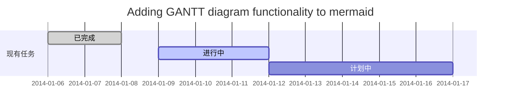
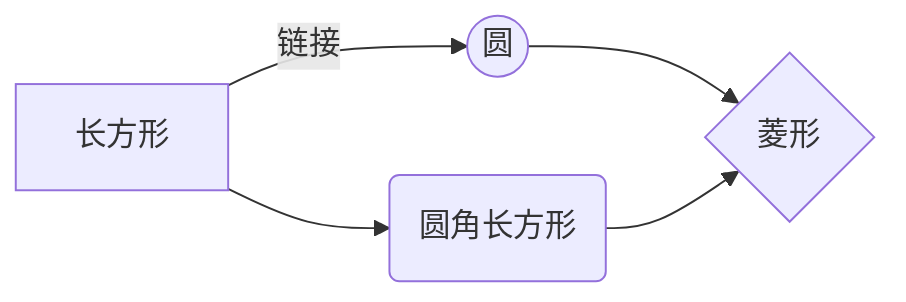

标题
---------------------------
# 1级标题
## 2级标题
### 3级标题
#### 四级标题
##### 五级标题
###### 陆级标题


换行
---------------------------
想了很长时间, 文字太长了<br/>不适合放在一行.


粗体与斜体
---------------------------
*强调文本*
**加粗文本** 
_强调文本_
__加粗文本__
==标记文本==
~~删除文本~~

列表
----------------------------
- 项目1
- 项目2
* 项目3
+ 项目4

有序列表
----------------------------
1. 文本1 
2. 文本2
3. 文本3 

代办清单
----------------------------
- [x] 完成任务
    - [x] 完成任务1
    - [x] 完成任务2
- [ ] 计划任务
    - [ ] 计划待任务1
    - [ ] 计划待任务2

链接
---------------------------
链接: [link](https://mp.csdn.net).
图片: 

引用
---------------------------
> 一级引用
>> 二级引用
>>> 三级引用
>>>> 四级引用
>>>>> 五级引用

表格
---------------------------
:-- 左对齐，:--: 居中对齐，--: 右对齐

| UserId  | UserName | PassWord |
| :------ | :------: | ------:  |
| 1       | Kevin    | 12345678 |
| 2       | Kevin    | 12345678 |
| 3       | Kevin    | 12345678 |
| 4       | Kevin    | 12345678 |


代码片
---------------------------
下面展示一些 `内联代码片`。
```
// A code block
var foo = 'bar';
```

```javascript
// An highlighted block
var foo = 'bar';
```
1. 代码片必须手动声明代码语言类型


特殊符号
---------------------------

&copy; &  &uml; &trade; &iexcl; &pound;
&amp; &lt; &gt; &yen; &euro; &reg; &plusmn; &para; &sect; &brvbar; &macr; &laquo; &middot;

X&sup2; Y&sup3; &frac34; &frac14;  &times;  &divide;   &raquo;

18&ordm;C  &quot;  &apos;


注脚
---------------------------
一个具有注脚的文本。[^1]

[^1]: 注脚的解释

注释
---------------------------

Markdown将文本转换为 HTML。
*[HTML]: 超文本标记语言

KaTex 数学公式
---------------------------

$$E=mc^2$$

行内的公式$$E=mc^2$$行内的公式，行内的$$E=mc^2$$公式。

$$x > y$$

$$\(\sqrt{3x-1}+(1+x)^2\)$$

$$\sin(\alpha)^{\theta}=\sum_{i=0}^{n}(x^i + \cos(f))$$

多行公式：

```math
\displaystyle
\left( \sum\_{k=1}^n a\_k b\_k \right)^2
\leq
\left( \sum\_{k=1}^n a\_k^2 \right)
\left( \sum\_{k=1}^n b\_k^2 \right)
```
```katex
\displaystyle
    \frac{1}{
        \Bigl(\sqrt{\phi \sqrt{5}}-\phi\Bigr) e^{
        \frac25 \pi}} = 1+\frac{e^{-2\pi}} {1+\frac{e^{-4\pi}} {
        1+\frac{e^{-6\pi}}
        {1+\frac{e^{-8\pi}}
         {1+\cdots} }
        }
    }
```
```latex
f(x) = \int_{-\infty}^\infty
    \hat f(\xi)\,e^{2 \pi i \xi x}
    \,d\xi
```

插入甘特图
---------------------------


插入UML图（sequenceDiagram）
------------

```seq
张三 ->> 李四: 你好！李四, 最近怎么样?
李四-->>王五: 你最近怎么样，王五？
李四--x 张三: 我很好，谢谢!
李四-x 王五: 我很好，谢谢!
Note right of 王五: 李四想了很长时间, 文字太长了<br/>不适合放在一行.
李四-->>张三: 打量着王五...
张三->>王五: 很好... 王五, 你怎么样?
```

插入Mermaid流程图
--------


插入Flowchart流程图
-------

```flow
st=>start: 开始
e=>end: 结束
op=>operation: 我的操作
cond=>condition: 确认？
st->op->cond
cond(yes)->e
cond(no)->op
```
